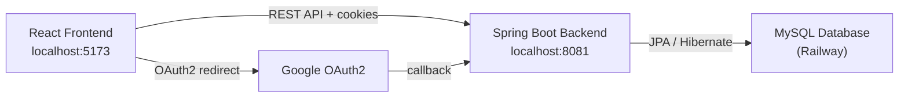
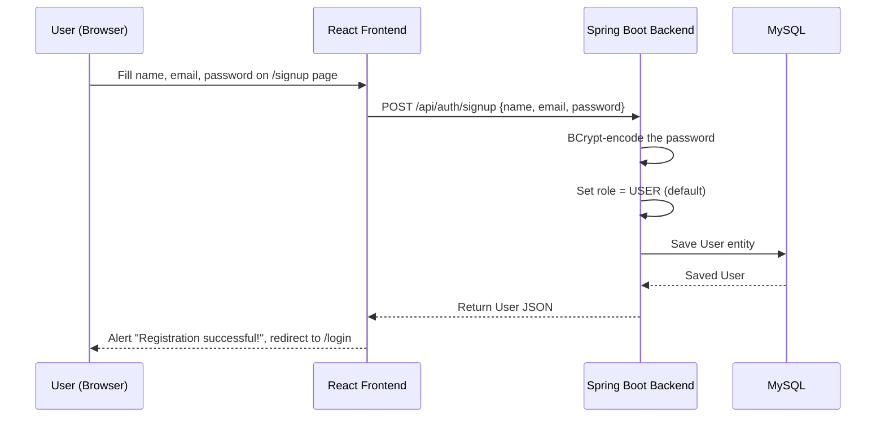
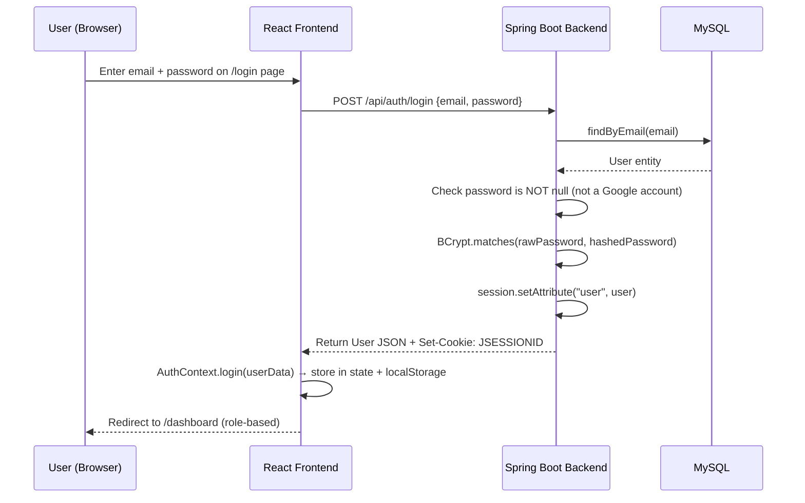
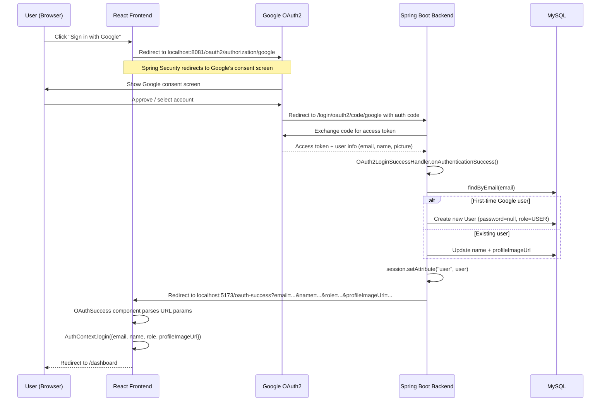
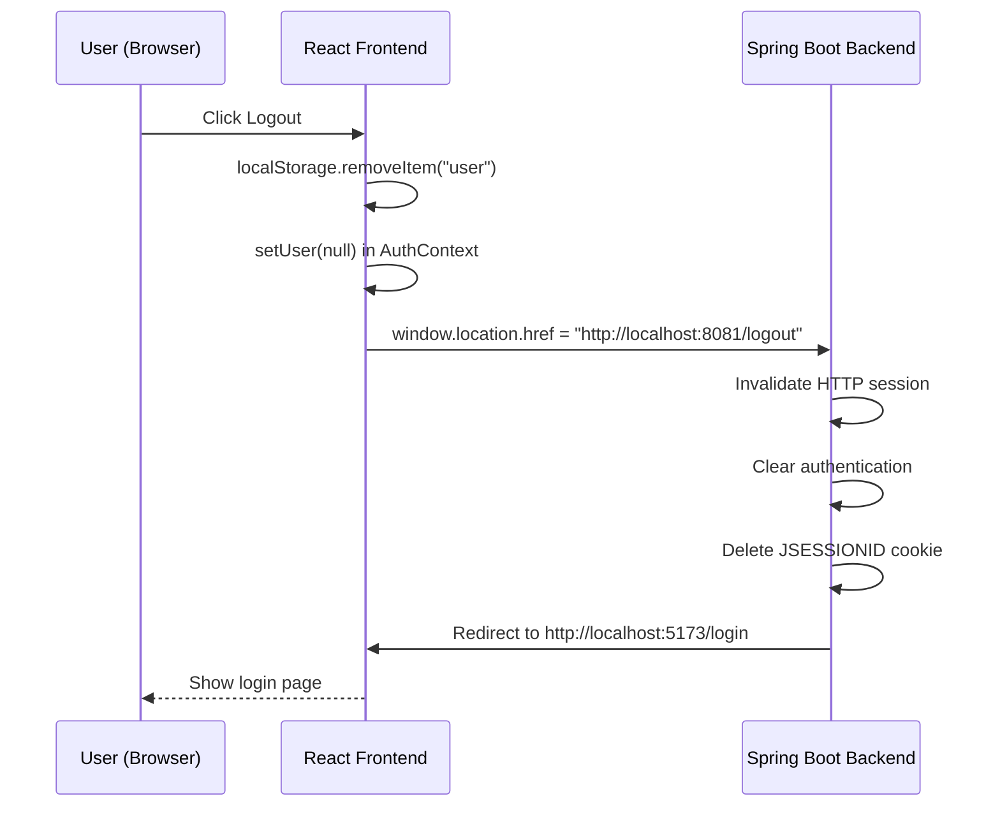

# Smart Campus — Authentication System (Full Description)

This document explains **everything** about how authentication and authorization works in the Smart Campus project, from the database all the way to the user's browser. It covers normal (email/password) login, Google OAuth2 login, roles, route protection, and logout.

---

## 1. High-Level Architecture

The system is a **Spring Boot + React** application:

| Layer | Technology | Purpose |
|-------|-----------|---------|
| **Frontend** | React (Vite) on `localhost:5173` | Renders the UI, stores auth state in `localStorage`, sends requests with cookies + `X-User-Email` header |
| **Backend** | Spring Boot on `localhost:8081` | REST API, session management (`JSESSIONID` cookie), OAuth2 login via Spring Security |
| **Database** | MySQL (Railway hosted) | Stores users (table `users`) with email, hashed password, role, profile image |



---

## 2. Data Model

### 2.1 User Entity
📂 [User.java](file:///c:/Users/LAKMAL/Desktop/github/New%20folder/it3030-paf-2026-smart-campus-group/backend/src/main/java/com/project/paf/modules/user/model/User.java)

```java
@Entity
@Table(name = "users")
public class User {
    @Id @GeneratedValue(strategy = GenerationType.IDENTITY)
    private Long id;

    private String name;

    @Column(unique = true)
    private String email;          // unique identifier for every user

    @Column(nullable = true)
    private String password;       // BCrypt hash — NULL for Google-only users

    @Enumerated(EnumType.STRING)
    private Role role;             // USER, ADMIN, TECHNICIAN, or MANAGER

    @Column(nullable = true)
    private String profileImageUrl; // Google profile pic URL or uploaded image
}
```

> [!IMPORTANT]
> The `password` column is **nullable**. When a user registers via Google, their password is set to `null`. This is how the system distinguishes between "normal" and "Google" accounts.

### 2.2 Role Enum
📂 [Role.java](file:///c:/Users/LAKMAL/Desktop/github/New%20folder/it3030-paf-2026-smart-campus-group/backend/src/main/java/com/project/paf/modules/user/model/Role.java)

```java
public enum Role {
    USER,        // Regular campus user (students, etc.)
    ADMIN,       // System administrator — can manage users, roles, all tickets
    TECHNICIAN,  // Handles assigned maintenance tickets
    MANAGER      // Views reports, analytics, manages resources
}
```

### 2.3 User Repository
📂 [UserRepository.java](file:///c:/Users/LAKMAL/Desktop/github/New%20folder/it3030-paf-2026-smart-campus-group/backend/src/main/java/com/project/paf/modules/user/repository/UserRepository.java)

```java
public interface UserRepository extends JpaRepository<User, Long> {
    Optional<User> findByEmail(String email);  // used everywhere for lookup
}
```

---

## 3. Normal (Email/Password) Authentication

### 3.1 Signup Flow



**Frontend:** 📂 [Signup.jsx](file:///c:/Users/LAKMAL/Desktop/github/New%20folder/it3030-paf-2026-smart-campus-group/frontend/src/pages/Signup.jsx)
- Collects `name`, `email`, `password` from the form
- Sends `POST /api/auth/signup` via the Axios instance
- On success → alerts user and navigates to `/login`

**Backend:** 📂 [AuthController.java](file:///c:/Users/LAKMAL/Desktop/github/New%20folder/it3030-paf-2026-smart-campus-group/backend/src/main/java/com/project/paf/modules/auth/controller/AuthController.java) → 📂 [UserService.java](file:///c:/Users/LAKMAL/Desktop/github/New%20folder/it3030-paf-2026-smart-campus-group/backend/src/main/java/com/project/paf/modules/user/service/UserService.java)

```java
// AuthController
@PostMapping("/signup")
public User signup(@RequestBody User user) {
    return service.register(user);  
}

// UserService.register()
public User register(User user) {
    user.setPassword(encoder.encode(user.getPassword())); // BCrypt hash
    user.setRole(Role.USER);                               // Always USER by default
    return repo.save(user);
}
```

> [!NOTE]
> All self-registered users get the `USER` role. Only an ADMIN can change a user's role later via the admin panel.

---

### 3.2 Normal Login Flow



**Frontend:** 📂 [Login.jsx](file:///c:/Users/LAKMAL/Desktop/github/New%20folder/it3030-paf-2026-smart-campus-group/frontend/src/pages/Login.jsx)
- Sends `POST /api/auth/login` with `{ email, password }`
- On success: calls `login(res.data)` from `AuthContext`, which stores the user object in React state AND `localStorage`
- The `useEffect` hook detects the user is now set, and navigates to `/dashboard`

**Backend:** 📂 [AuthController.java](file:///c:/Users/LAKMAL/Desktop/github/New%20folder/it3030-paf-2026-smart-campus-group/backend/src/main/java/com/project/paf/modules/auth/controller/AuthController.java) → 📂 [UserService.java](file:///c:/Users/LAKMAL/Desktop/github/New%20folder/it3030-paf-2026-smart-campus-group/backend/src/main/java/com/project/paf/modules/user/service/UserService.java)

```java
// AuthController
@PostMapping("/login")
public User login(@RequestBody User request, HttpSession session) {
    User user = service.login(request.getEmail(), request.getPassword());
    session.setAttribute("user", user);  // ← stores in HTTP session
    return user;
}

// UserService.login()
public User login(String email, String password) {
    User user = repo.findByEmail(email)
        .orElseThrow(() -> new RuntimeException("User not found"));
    
    if (user.getPassword() == null) {
        // This is a Google-only account — block normal login
        throw new RuntimeException("This account uses Google Sign-In. Please login with Google.");
    }
    
    if (!encoder.matches(password, user.getPassword())) {
        throw new RuntimeException("Invalid credentials");
    }
    return user;
}
```

> [!WARNING]
> If a user originally signed up with Google (password is `null`), trying to log in with email/password will be **rejected** with the message "This account uses Google Sign-In."

---

## 4. Google OAuth2 Authentication

### 4.1 OAuth2 Configuration
📂 [application.properties](file:///c:/Users/LAKMAL/Desktop/github/New%20folder/it3030-paf-2026-smart-campus-group/backend/src/main/resources/application.properties)

```properties
spring.security.oauth2.client.registration.google.client-id=<Google Client ID>
spring.security.oauth2.client.registration.google.client-secret=<Google Client Secret>
spring.security.oauth2.client.registration.google.scope=email,profile
spring.security.oauth2.client.registration.google.redirect-uri=http://localhost:8081/login/oauth2/code/google
spring.security.oauth2.client.registration.google.authorization-grant-type=authorization_code
```

The scopes `email` and `profile` are requested — this gives the application the user's email, name, and profile picture.

### 4.2 Google Login Flow



### 4.3 Key Backend File: OAuth2LoginSuccessHandler
📂 [OAuth2LoginSuccessHandler.java](file:///c:/Users/LAKMAL/Desktop/github/New%20folder/it3030-paf-2026-smart-campus-group/backend/src/main/java/com/project/paf/modules/auth/service/OAuth2LoginSuccessHandler.java)

This class implements `AuthenticationSuccessHandler` and is invoked by Spring Security after a successful Google login:

```java
public void onAuthenticationSuccess(HttpServletRequest request,
                                    HttpServletResponse response,
                                    Authentication authentication) throws IOException {

    OAuth2User oAuth2User = (OAuth2User) authentication.getPrincipal();
    String email = oAuth2User.getAttribute("email");
    String name  = oAuth2User.getAttribute("name");
    String profileImageUrl = oAuth2User.getAttribute("picture");

    Optional<User> existingUser = userRepository.findByEmail(email);
    User user;

    if (existingUser.isEmpty()) {
        // FIRST-TIME Google login → create user
        user = new User();
        user.setEmail(email);
        user.setName(name);
        user.setPassword(null);   // ← Google users have NO password
        user.setRole(Role.USER);  // ← default role
    } else {
        user = existingUser.get();
    }

    // Always update name + picture from Google
    user.setName(name);
    user.setProfileImageUrl(profileImageUrl);
    user = userRepository.save(user);

    // Store in HTTP session (same as normal login)
    request.getSession().setAttribute("user", user);

    // Redirect back to frontend with user data in URL params
    response.sendRedirect(
        "http://localhost:5173/oauth-success?email=" + encode(email)
        + "&name=" + encode(name)
        + "&role=" + encode(user.getRole().name())
        + "&profileImageUrl=" + encode(profileImageUrl)
    );
}
```

### 4.4 Key Frontend File: OAuthSuccess Component
📂 [OAuthSuccess.jsx](file:///c:/Users/LAKMAL/Desktop/github/New%20folder/it3030-paf-2026-smart-campus-group/frontend/src/components/OAuthSuccess.jsx)

This is a "bridge" page at `/oauth-success` that:
1. Reads `email`, `name`, `role`, `profileImageUrl` from the URL query parameters
2. Calls `AuthContext.login(...)` to save the user into React state + `localStorage`
3. Immediately navigates to `/dashboard`

```jsx
const email = params.get("email");
const name  = params.get("name");
const role  = params.get("role");
const profileImageUrl = params.get("profileImageUrl");

if (email && name && role) {
    login({ email, name, role, profileImageUrl });
    navigate("/dashboard", { replace: true });
}
```

> [!NOTE]
> The user data is passed via **URL query parameters** from the backend redirect. This is a simple approach that avoids CORS complexities. The backend also sets the `JSESSIONID` cookie during this redirect.

---

## 5. Session Management & Request Authentication

The system uses **two parallel mechanisms** to identify the current user on each API request:

### 5.1 Mechanism 1: HTTP Session (`JSESSIONID` cookie)
- When a user logs in (normal or Google), `session.setAttribute("user", user)` stores the `User` object in the Spring HTTP session
- The browser receives a `JSESSIONID` cookie automatically
- Subsequent requests include this cookie, and Spring can retrieve the session

### 5.2 Mechanism 2: `X-User-Email` Header (Fallback)
- The frontend Axios interceptor automatically attaches the user's email from `localStorage` on **every request**

📂 [api.js](file:///c:/Users/LAKMAL/Desktop/github/New%20folder/it3030-paf-2026-smart-campus-group/frontend/src/services/api.js)

```javascript
api.interceptors.request.use((config) => {
    const raw = localStorage.getItem("user");
    if (raw) {
        const user = JSON.parse(raw);
        if (user?.email) {
            config.headers["X-User-Email"] = user.email;
        }
    }
    return config;
});
```

> [!IMPORTANT]
> The `X-User-Email` header acts as a **fallback** for when the Spring session has expired but the user is still "logged in" on the frontend (they have data in `localStorage`). The backend looks up the email in the database to re-identify the user.

### 5.3 The AuthenticationFilter
📂 [AuthenticationFilter.java](file:///c:/Users/LAKMAL/Desktop/github/New%20folder/it3030-paf-2026-smart-campus-group/backend/src/main/java/com/project/paf/config/AuthenticationFilter.java)

This is a custom Spring `OncePerRequestFilter` that runs **before** every request reaches a controller. Its job is to populate the Spring Security `SecurityContext` so that `@PreAuthorize` annotations and `.hasAnyRole(...)` rules work correctly.

```java
@Override
protected void doFilterInternal(HttpServletRequest request, HttpServletResponse response, 
                                FilterChain filterChain) {
    
    if (SecurityContextHolder.getContext().getAuthentication() == null) {
        
        String email = request.getHeader("X-User-Email");
        User user = null;

        // Priority 1: Check HTTP session
        HttpSession session = request.getSession(false);
        if (session != null && session.getAttribute("user") != null) {
            user = (User) session.getAttribute("user");
        }
        // Priority 2: Fall back to X-User-Email header
        else if (email != null && !email.isEmpty()) {
            user = userRepository.findByEmail(email).orElse(null);
        }

        // If we found a user, set up Spring Security authentication
        if (user != null) {
            List<SimpleGrantedAuthority> authorities = 
                List.of(new SimpleGrantedAuthority("ROLE_" + user.getRole().name()));
            
            UsernamePasswordAuthenticationToken authentication = 
                new UsernamePasswordAuthenticationToken(user, null, authorities);
            
            SecurityContextHolder.getContext().setAuthentication(authentication);
        }
    }

    filterChain.doFilter(request, response);
}
```

**Key points:**
1. It only runs if there's no existing authentication (avoids overriding OAuth2 session)
2. It tries the **session first**, then the **email header**
3. It creates a `UsernamePasswordAuthenticationToken` with the authority `ROLE_USER`, `ROLE_ADMIN`, `ROLE_TECHNICIAN`, or `ROLE_MANAGER`
4. This token is what Spring Security checks for `hasAnyRole(...)` rules

### 5.4 Filter Chain Order
📂 [SecurityConfig.java](file:///c:/Users/LAKMAL/Desktop/github/New%20folder/it3030-paf-2026-smart-campus-group/backend/src/main/java/com/project/paf/config/SecurityConfig.java)

```java
http.addFilterBefore(authenticationFilter, 
    UsernamePasswordAuthenticationFilter.class);
```

The `AuthenticationFilter` is inserted **before** Spring's built-in `UsernamePasswordAuthenticationFilter`. So the processing order for each request is:

```
1. CORS filter
2. AuthenticationFilter (our custom filter — populates SecurityContext)
3. Spring Security's built-in filters
4. Authorization checks (permitAll, hasAnyRole, etc.)
5. Controller method
```

---

## 6. Authorization (Who Can Access What)

### 6.1 Backend: SecurityFilterChain Rules
📂 [SecurityConfig.java](file:///c:/Users/LAKMAL/Desktop/github/New%20folder/it3030-paf-2026-smart-campus-group/backend/src/main/java/com/project/paf/config/SecurityConfig.java)

```java
.authorizeHttpRequests(auth -> auth
    // Public — no login required
    .requestMatchers("/", "/api/auth/**").permitAll()
    
    // Admin endpoints — permitAll at filter level, but manually checked in controller
    .requestMatchers("/api/admin/**").permitAll()
    
    // Booking endpoints — only USER, ADMIN, MANAGER roles
    .requestMatchers("/api/bookings/**").hasAnyRole("USER", "ADMIN", "MANAGER")
    
    // Ticket endpoints — permitAll at filter level, manually checked in controller
    .requestMatchers("/api/tickets/**").permitAll()
    
    // Everything else — must be authenticated
    .anyRequest().authenticated()
)
```

| Endpoint Pattern | Access Level | Notes |
|-----------------|-------------|-------|
| `/api/auth/**` | Public | Signup + login endpoints |
| `/api/admin/**` | `permitAll` (filter) + **manual ADMIN check** in controller | See section 6.2 |
| `/api/bookings/**` | `ROLE_USER`, `ROLE_ADMIN`, `ROLE_MANAGER` | Spring Security enforced |
| `/api/tickets/**` | `permitAll` (filter) + manual checks in service | Controller handles auth |
| Everything else | Must be authenticated | Any logged-in user |

### 6.2 Backend: AdminController Manual Guard
📂 [AdminController.java](file:///c:/Users/LAKMAL/Desktop/github/New%20folder/it3030-paf-2026-smart-campus-group/backend/src/main/java/com/project/paf/modules/user/controller/AdminController.java)

The admin endpoints use `permitAll` at the security filter chain level, but every method calls `requireAdmin()`:

```java
private void requireAdmin(HttpSession session, String emailHeader) {
    User resolved = null;

    // 1. Try session first
    if (session.getAttribute("user") instanceof User) {
        resolved = (User) session.getAttribute("user");
    }

    // 2. Fall back to X-User-Email header
    if (resolved == null && emailHeader != null && !emailHeader.isBlank()) {
        resolved = repo.findByEmail(emailHeader).orElse(null);
    }

    // 3. Must be logged in
    if (resolved == null) throw 401 Unauthorized;
    
    // 4. Must be ADMIN role
    if (resolved.getRole() != Role.ADMIN) throw 403 Forbidden;
}
```

**Admin capabilities:**
- `GET /api/admin/users` — List all users
- `PUT /api/admin/users/{id}/role?role=MANAGER` — Change any user's role
- `DELETE /api/admin/users/{id}` — Delete a user
- `POST /api/admin/users` — Create a new user with a generated random password

### 6.3 Frontend: AuthContext (Client-Side Auth State)
📂 [AuthContext.jsx](file:///c:/Users/LAKMAL/Desktop/github/New%20folder/it3030-paf-2026-smart-campus-group/frontend/src/context/AuthContext.jsx)

The `AuthProvider` wraps the entire app and provides:

```javascript
const value = {
    user,              // The user object {email, name, role, profileImageUrl, ...}
    setUser,           // Direct setter
    role: user?.role,  // Shorthand for the role string
    login,             // Store user in state + localStorage
    logout,            // Clear state + localStorage + redirect to Spring's /logout
    isAuthenticated,   // Boolean: !!user
    isLoading,         // Loading state
};
```

On app load, it tries to restore the user from `localStorage`:
```javascript
const [user, setUser] = useState(() => {
    const storedUser = localStorage.getItem("user");
    // Parse and validate...
    return parsedUser || null;
});
```

### 6.4 Frontend: RoleProtectedRoute (Client-Side Route Guard)
📂 [RoleProtectedRoute.jsx](file:///c:/Users/LAKMAL/Desktop/github/New%20folder/it3030-paf-2026-smart-campus-group/frontend/src/components/RoleProtectedRoute.jsx)

This component wraps protected routes and checks:

```jsx
const RoleProtectedRoute = ({ children, allowedRoles }) => {
    const { user, role, isAuthenticated } = useAuth();

    // Not logged in → redirect to /login
    if (!user || !isAuthenticated) {
        return <Navigate to="/login" />;
    }

    // Logged in but wrong role → redirect to /unauthorized
    if (allowedRoles && !allowedRoles.includes(role)) {
        return <Navigate to="/unauthorized" />;
    }

    return children;  // ✅ Allowed
};
```

### 6.5 Frontend: Role-Based Dashboard Routing
📂 [App.jsx](file:///c:/Users/LAKMAL/Desktop/github/New%20folder/it3030-paf-2026-smart-campus-group/frontend/src/App.jsx)

When a user navigates to `/dashboard`, the `RoleBasedRedirect` component checks the user's role and redirects:

```jsx
switch (user.role?.toUpperCase()) {
    case "ADMIN":      return <Navigate to="/dashboard/admin" />;
    case "MANAGER":    return <Navigate to="/dashboard/manager" />;
    case "TECHNICIAN": return <Navigate to="/dashboard/technician" />;
    default:           return <Navigate to="/dashboard/user" />;
}
```

Each role-specific route section is wrapped in `<ProtectedRoute allowedRoles={[...]}>`:

| Role | Dashboard Path | Available Pages |
|------|---------------|-----------------|
| **USER** | `/dashboard/user` | Overview, My Bookings, Create Booking, My Tickets, Report Incident, Resources, Profile |
| **ADMIN** | `/dashboard/admin` | Dashboard, User Management, Role Management, All Tickets, System Settings, Resources |
| **MANAGER** | `/dashboard/manager` | Dashboard, Reports, Booking Analytics, Maintenance, Resources |
| **TECHNICIAN** | `/dashboard/technician` | Dashboard, Assigned Tickets, Update Status, History |

### 6.6 Frontend: Navigation Sidebar Per Role
📂 [navigation.js](file:///c:/Users/LAKMAL/Desktop/github/New%20folder/it3030-paf-2026-smart-campus-group/frontend/src/routes/navigation.js)

Each role has its own sidebar navigation items defined in `roleNavigation`:
- `USER`: 7 items (Overview, My Bookings, Create Booking, My Tickets, Report Incident, Profile, Resources)
- `ADMIN`: 6 items (Dashboard, User Management, Role Management, All Tickets, System Settings, Resources)
- `MANAGER`: 5 items (Dashboard, Reports, Booking Analytics, Maintenance, Resources)
- `TECHNICIAN`: 4 items (Dashboard, Assigned Tickets, Update Status, History)

---

## 7. Logout Flow



📂 [AuthContext.jsx](file:///c:/Users/LAKMAL/Desktop/github/New%20folder/it3030-paf-2026-smart-campus-group/frontend/src/context/AuthContext.jsx)
```javascript
const logout = useCallback(() => {
    localStorage.removeItem("user");
    setUser(null);
    window.location.href = "http://localhost:8081/logout";  // Spring's logout endpoint
}, []);
```

📂 [SecurityConfig.java](file:///c:/Users/LAKMAL/Desktop/github/New%20folder/it3030-paf-2026-smart-campus-group/backend/src/main/java/com/project/paf/config/SecurityConfig.java)
```java
.logout(logout -> logout
    .logoutUrl("/logout")
    .logoutSuccessUrl("http://localhost:5173/login")  // redirect after logout
    .invalidateHttpSession(true)
    .clearAuthentication(true)
    .deleteCookies("JSESSIONID"))
```

---

## 8. Normal vs. Google User — Key Differences

| Aspect | Normal User | Google User |
|--------|-------------|-------------|
| **Registration** | `POST /api/auth/signup` with name, email, password | First Google login auto-creates account |
| **Password** | BCrypt-hashed, stored in DB | `null` (no password stored) |
| **Login** | `POST /api/auth/login` (email + password) | Redirect to Google OAuth2 consent screen |
| **Profile Image** | Manually uploaded | Auto-fetched from Google, updated every login |
| **Session Creation** | `session.setAttribute("user", user)` in `AuthController` | `session.setAttribute("user", user)` in `OAuth2LoginSuccessHandler` |
| **Frontend Data Flow** | API response body → `AuthContext.login()` | URL query params → `OAuthSuccess` → `AuthContext.login()` |
| **Password Change** | Allowed via `PUT /api/user/me/password` | Blocked ("Google users cannot change password") |
| **Default Role** | `USER` | `USER` |
| **Can login the other way?** | ❌ Cannot use Google unless they also have a Google account with the same email | ❌ Cannot use email/password login (password is null) |

---

## 9. How Admin Creates Users with Different Roles

📂 [AdminController.java](file:///c:/Users/LAKMAL/Desktop/github/New%20folder/it3030-paf-2026-smart-campus-group/backend/src/main/java/com/project/paf/modules/user/controller/AdminController.java)

An ADMIN can create users with any role via `POST /api/admin/users`:

```java
@PostMapping("/users")
public ResponseEntity<Map<String, Object>> createUser(@RequestBody Map<String, String> body, ...) {
    requireAdmin(session, emailHeader);  // only ADMINs
    
    String plainPassword = generateRandomPassword(10);  // random 10-char password
    
    User user = new User();
    user.setName(body.get("name"));
    user.setEmail(body.get("email"));
    user.setPassword(encoder.encode(plainPassword));
    user.setRole(role != null ? Role.valueOf(role) : Role.USER);
    
    // Returns the user + plain-text password (shown once to admin)
    response.put("generatedPassword", plainPassword);
}
```

An ADMIN can also **change an existing user's role**:
```
PUT /api/admin/users/{id}/role?role=TECHNICIAN
```

This is the **only way** to create TECHNICIAN, MANAGER, or ADMIN users — self-registration always assigns `USER`.

---

## 10. CORS Configuration

📂 [SecurityConfig.java](file:///c:/Users/LAKMAL/Desktop/github/New%20folder/it3030-paf-2026-smart-campus-group/backend/src/main/java/com/project/paf/config/SecurityConfig.java)

```java
configuration.setAllowedOrigins(List.of("http://localhost:5173"));   // frontend origin
configuration.setAllowedMethods(Arrays.asList("GET", "POST", "PUT", "DELETE", "PATCH", "OPTIONS"));
configuration.setAllowedHeaders(Arrays.asList("Authorization", "Content-Type", 
                                               "X-Requested-With", "X-User-Email"));
configuration.setAllowCredentials(true);  // allows JSESSIONID cookie
```

> [!NOTE]
> `allowCredentials(true)` is critical — without it, the browser won't send the `JSESSIONID` cookie on cross-origin requests, breaking session-based auth.

---

## 11. Error Handling for Unauthorized Requests

📂 [SecurityConfig.java](file:///c:/Users/LAKMAL/Desktop/github/New%20folder/it3030-paf-2026-smart-campus-group/backend/src/main/java/com/project/paf/config/SecurityConfig.java)

Instead of redirecting to a login page (default Spring behavior), the API returns JSON errors:

```java
.exceptionHandling(ex -> ex
    .authenticationEntryPoint((request, response, authException) -> {
        response.setContentType("application/json");
        response.setStatus(401);
        response.getWriter().write("{\"error\":\"Unauthorized\"}");
    })
    .accessDeniedHandler((request, response, accessDeniedException) -> {
        response.setContentType("application/json");
        response.setStatus(403);
        response.getWriter().write("{\"error\":\"Forbidden\"}");
    })
)
```

| HTTP Status | Meaning | When |
|-------------|---------|------|
| **401** | Unauthorized | No valid session/header, user is not logged in |
| **403** | Forbidden | User is logged in but doesn't have the required role |

---

## 12. Complete File Reference

### Backend (Spring Boot)

| File | Purpose |
|------|---------|
| [SecurityConfig.java](file:///c:/Users/LAKMAL/Desktop/github/New%20folder/it3030-paf-2026-smart-campus-group/backend/src/main/java/com/project/paf/config/SecurityConfig.java) | Main security configuration: filter chain, CORS, OAuth2, logout, error handling |
| [AuthenticationFilter.java](file:///c:/Users/LAKMAL/Desktop/github/New%20folder/it3030-paf-2026-smart-campus-group/backend/src/main/java/com/project/paf/config/AuthenticationFilter.java) | Custom filter that populates SecurityContext from session or X-User-Email header |
| [AuthController.java](file:///c:/Users/LAKMAL/Desktop/github/New%20folder/it3030-paf-2026-smart-campus-group/backend/src/main/java/com/project/paf/modules/auth/controller/AuthController.java) | REST endpoints for `/api/auth/signup` and `/api/auth/login` |
| [OAuth2LoginSuccessHandler.java](file:///c:/Users/LAKMAL/Desktop/github/New%20folder/it3030-paf-2026-smart-campus-group/backend/src/main/java/com/project/paf/modules/auth/service/OAuth2LoginSuccessHandler.java) | Handles post-Google-login: creates/updates user, sets session, redirects to frontend |
| [CustomUserDetailsService.java](file:///c:/Users/LAKMAL/Desktop/github/New%20folder/it3030-paf-2026-smart-campus-group/backend/src/main/java/com/project/paf/modules/auth/service/CustomUserDetailsService.java) | Spring Security `UserDetailsService` implementation (used by Spring internals) |
| [UserService.java](file:///c:/Users/LAKMAL/Desktop/github/New%20folder/it3030-paf-2026-smart-campus-group/backend/src/main/java/com/project/paf/modules/user/service/UserService.java) | Business logic: register, login, update profile, change password, delete |
| [UserController.java](file:///c:/Users/LAKMAL/Desktop/github/New%20folder/it3030-paf-2026-smart-campus-group/backend/src/main/java/com/project/paf/modules/user/controller/UserController.java) | REST endpoints for `/api/user/me` (get profile, update, change password, delete account) |
| [AdminController.java](file:///c:/Users/LAKMAL/Desktop/github/New%20folder/it3030-paf-2026-smart-campus-group/backend/src/main/java/com/project/paf/modules/user/controller/AdminController.java) | Admin-only endpoints for user management and role changes |
| [User.java](file:///c:/Users/LAKMAL/Desktop/github/New%20folder/it3030-paf-2026-smart-campus-group/backend/src/main/java/com/project/paf/modules/user/model/User.java) | JPA entity for the `users` table |
| [Role.java](file:///c:/Users/LAKMAL/Desktop/github/New%20folder/it3030-paf-2026-smart-campus-group/backend/src/main/java/com/project/paf/modules/user/model/Role.java) | Enum: USER, ADMIN, TECHNICIAN, MANAGER |
| [UserRepository.java](file:///c:/Users/LAKMAL/Desktop/github/New%20folder/it3030-paf-2026-smart-campus-group/backend/src/main/java/com/project/paf/modules/user/repository/UserRepository.java) | JPA repository with `findByEmail()` |
| [application.properties](file:///c:/Users/LAKMAL/Desktop/github/New%20folder/it3030-paf-2026-smart-campus-group/backend/src/main/resources/application.properties) | DB config, OAuth2 client credentials, server port |

### Frontend (React)

| File | Purpose |
|------|---------|
| [AuthContext.jsx](file:///c:/Users/LAKMAL/Desktop/github/New%20folder/it3030-paf-2026-smart-campus-group/frontend/src/context/AuthContext.jsx) | React context: stores user state, provides login/logout functions, restores from localStorage |
| [Login.jsx](file:///c:/Users/LAKMAL/Desktop/github/New%20folder/it3030-paf-2026-smart-campus-group/frontend/src/pages/Login.jsx) | Login page: email/password form + Google sign-in button |
| [Signup.jsx](file:///c:/Users/LAKMAL/Desktop/github/New%20folder/it3030-paf-2026-smart-campus-group/frontend/src/pages/Signup.jsx) | Signup page: registration form + Google sign-up button |
| [OAuthSuccess.jsx](file:///c:/Users/LAKMAL/Desktop/github/New%20folder/it3030-paf-2026-smart-campus-group/frontend/src/components/OAuthSuccess.jsx) | Bridge page that parses Google login redirect params and stores user in AuthContext |
| [RoleProtectedRoute.jsx](file:///c:/Users/LAKMAL/Desktop/github/New%20folder/it3030-paf-2026-smart-campus-group/frontend/src/components/RoleProtectedRoute.jsx) | Route guard: checks authentication and role before rendering children |
| [App.jsx](file:///c:/Users/LAKMAL/Desktop/github/New%20folder/it3030-paf-2026-smart-campus-group/frontend/src/App.jsx) | Route definitions: maps roles to dashboard sections, wraps routes in ProtectedRoute |
| [api.js](file:///c:/Users/LAKMAL/Desktop/github/New%20folder/it3030-paf-2026-smart-campus-group/frontend/src/services/api.js) | Axios instance: sets base URL, credentials, attaches X-User-Email header on every request |
| [navigation.js](file:///c:/Users/LAKMAL/Desktop/github/New%20folder/it3030-paf-2026-smart-campus-group/frontend/src/routes/navigation.js) | Sidebar navigation items per role |
